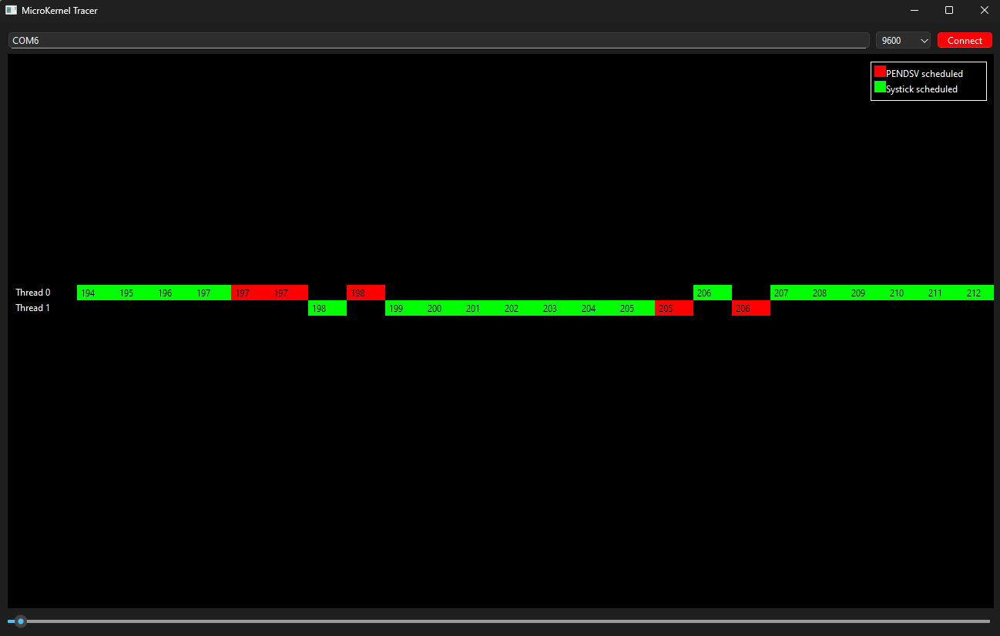

# **MicroKernelTracer**

**v1.0.0**

# Table of contents

- [Overview](#overview)
- [Versions](#versions)
- [Example](#example)


# Overview

**MicroKernelTracer** is a Desktop application that visualizes the scheduler behavior of [MicroKernel](https://github.com/AyikOzgur/MicroKernel/tree/master). **MicroKernelTracer** depends on Qt6
libraries and it is supported only for WINDOWS OS.

# Versions

**Table 1** - Library versions.

| Version | Release date | What's new                                                   |
| ------- | ------------ | ------------------------------------------------------------ |
| 1.0.0   | 23.02.2025   | - First version.                                             |

# Example

Following code is executed by **MicroKernel** : 

```c
#include <stdlib.h>
#include <stdio.h>

#include "systemClock.h"
#include "stm32f4xx.h"
#include "kernel.h"
#include "kernelConfig.h"
#include "Mutex.h"
#include "Semaphore.h"

#include "uart.h"

#define THREAD_STACK_SIZE_BYTES  400
#define MAX_NUM_THREAD           10
#define SCHEDULER_PERIOD_MS      10

uint32_t g_sharedData = 0;
Mutex_t *g_sharedDataMutex = NULL;
Semaphore_t *g_dataAvailableSem = NULL;

void producerThreadFunc()
{
  while (1)
  {
    Mutex_lock(g_sharedDataMutex);
    for (int i = 0; i < 500000; ++i);
    g_sharedData++;
    Mutex_unlock(g_sharedDataMutex);

    Semaphore_release(g_dataAvailableSem);
  }
}

void consumerThreadFunc()
{
  uint32_t readValue = 0;
  while (1)
  {
    Semaphore_acquire(g_dataAvailableSem);

    Mutex_lock(g_sharedDataMutex);
    for (int i = 0; i < 500000; ++i);
    readValue = g_sharedData;
    Mutex_unlock(g_sharedDataMutex);
  }
}

int main(void)
{
  initSystemClock();

#ifdef TRACER_ON
  usart2_init(9600);
  setSendTracerDataCallback(usart2_send_data);
#endif

  initKernel(MAX_NUM_THREAD);

  g_sharedDataMutex = Mutex_create();
  g_dataAvailableSem = Semaphore_create(0, 1); // Initial value 0, max value 1.

  addThread(producerThreadFunc, THREAD_STACK_SIZE_BYTES);
  addThread(consumerThreadFunc, THREAD_STACK_SIZE_BYTES);

  startScheduler(SCHEDULER_PERIOD_MS);

  return 0; // Code execution never reaches here
}

```

Following image shows the **MicroKernelTracer** output for code provided above : 



Explanation of figure: 

|Tick | Event explanation |
|---| ---- |
|197| producer thread releases semaphore and unlocks mutex.     |
|198| consumer thread locks the mutex and producer thread is put to sleep by kernel.     |
|205| consumer thread unlocks the mutex.     |
|206| producer thread acquires semaphore and consumer thread is put to sleep by kernel.     |